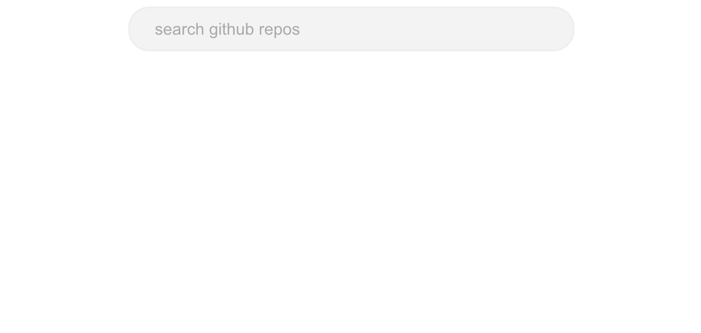
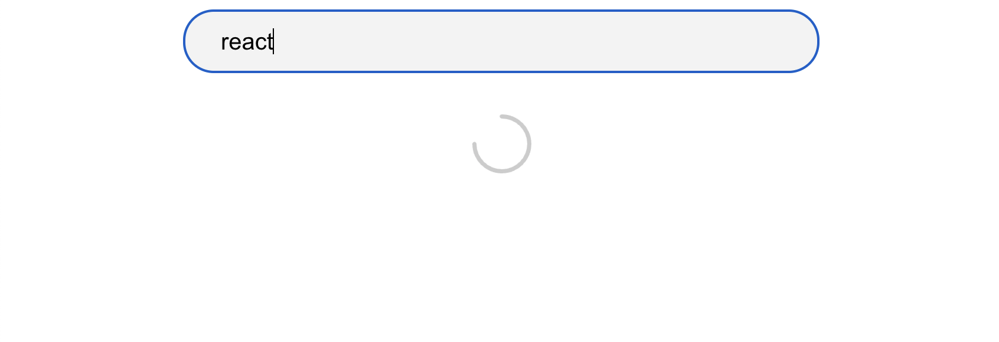
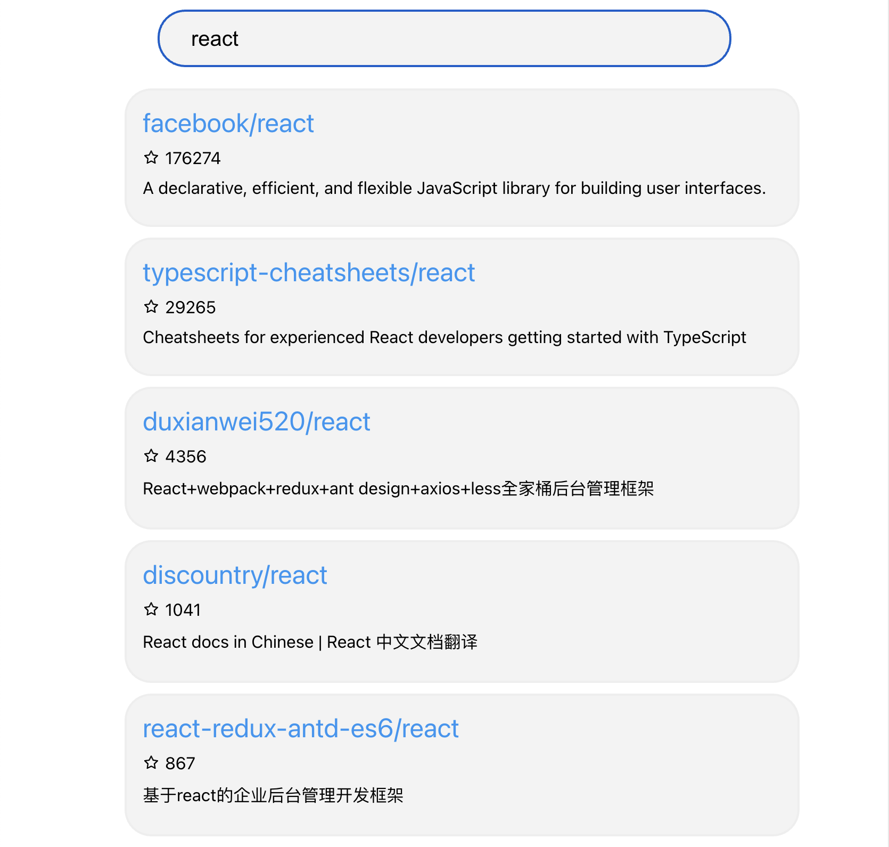
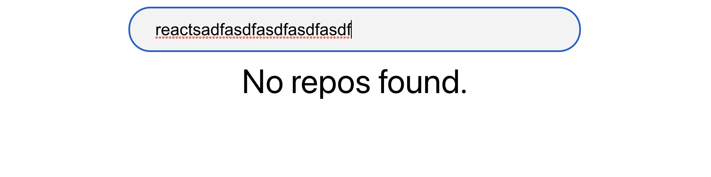
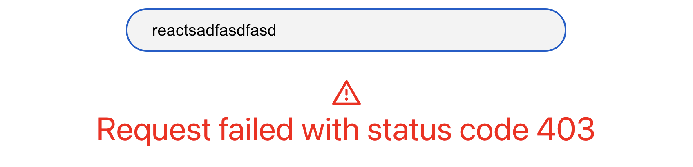

# Github Repo Hound

## 啟動方法

建議使用 Node 16.5.0 版本。

### 開發

1. 執行 `npm install`
2. 執行 `npm start`
3. 至 http://localhost:3000。

### Production Build

1. 執行 `npm run build`
2. 執行 `npx serve -s build -p 5000`
3. 至 http://localhost:5000

## 架構說明

### 使用套件

1. [Create React App](https://github.com/facebook/create-react-app)：快速建立 React 專案。
2. [Lodash](https://lodash.com/)：提供資料處理的工具、函式。
3. [Axios](https://axios-http.com/)：用來做網路請求，提供 url params、cancel 等功能。
4. [Styled Components](https://styled-components.com/)：CSS-In-JS 的函式庫。

### Components

1. `App`：最外層的 component，包含 `Input` 和 `RepoList` component。
2. `Input`：搜尋的輸入匡
3. `RepoList`
   1. 在 input 為空時為空白。
   2. 在網路請求時顯示 loading icon。
   3. 發生錯誤時會用紅字顯示 error message，通常為 `403` rate limit 的限制。
   4. 在輸入 input 並搜索到資料後，使用 `Repo` component 顯示 github repositories。
   5. 在沒有搜索到 github repositories 時顯示 `No repos found.`。
4. `Repo`：顯示 Github repositories，包含以下資訊：
   1. `full_name`：專案全名，點擊後可以跳轉。
   2. `stargazers_count`：星星數目。
   3. `description`：專案描述。

Initial State：

Loading：

Result:

Not Found:

Error：

### githubAPI.js

針對 axios、Github API 的邏輯進行簡單的封裝，並使用 Fluent Interface 的 pattern 加強可讀性。

### Hooks

1. `useFetchRepos`：
   1. 對 [Github Search repositories API](https://developer.github.com/v3/search/#search-repositories) 進行網路請求獲取資料。
   2. 對 error、loading 狀態進行處理。
   3. 針對 pagination 進行處理（每次讀取 10 筆資料），將新頁面資料合併到現有資料中，並且 unique by id 來避免重複。
   4. 用 [axios cancel](https://axios-http.com/docs/cancellation) 來防止同時發出多個 requests。
2. `useDebounceFetchRepos`：
   1. 對 `useFetchRepos` 進行包裝，在 `query`、`page` 條件的變動時發出請求。
   2. 為避免過於頻繁的 requests 去 hit 到 [rate limit](https://docs.github.com/en/rest/reference/search#rate-limit)，使用 debounce 的方式減少請求數量（delay 設為 300ms）。
3. `useInfiniteScroll`：
   1. 當畫面滑動到最底部時觸發 `onBottom` callback，被用來獲取下一頁的資料。
   2. 當已經在 loading 時直接 early return，避免重複觸發請求。

### Mock 資料夾

測試資料，用來在開發初期、沒有網路環境下使用，並且作為 response 資料結構的參考。

## 在時間內尚未完成的功能、重構

1. 使用 SDK：[octokit.js](https://github.com/octokit/octokit.js)
2. 支援 RWD
3. 使用 [Intersection Observer API](https://developer.mozilla.org/en-US/docs/Web/API/Intersection_Observer_API) 來取代 `onscroll` 提升效能。
4. hooks、component 的 unit test。
